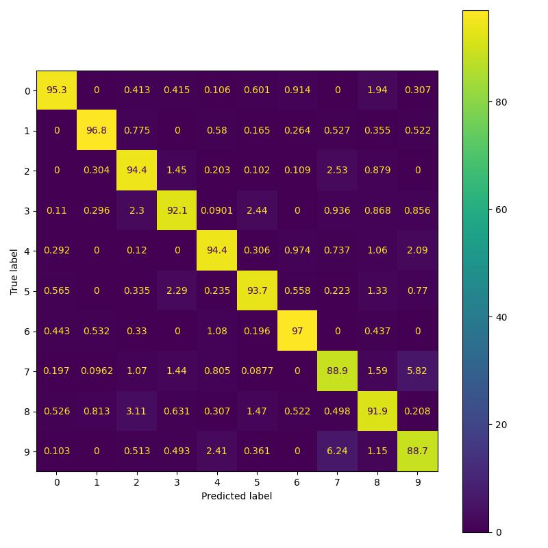
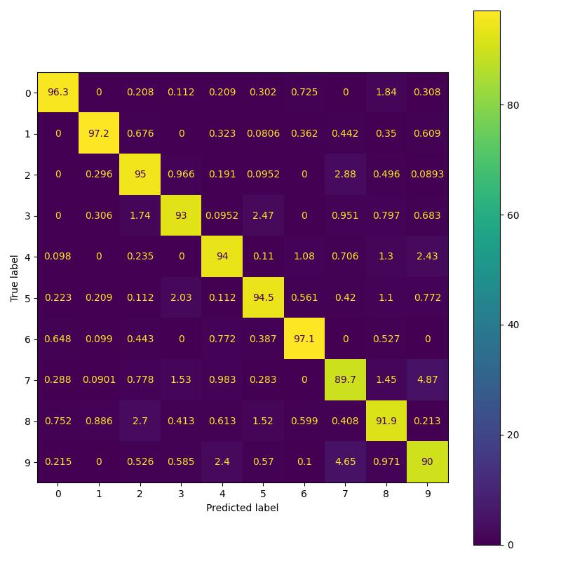

### Paper [link](https://openaccess.thecvf.com/content/CVPR2022/papers/Kag_Condensing_CNNs_With_Partial_Differential_Equations_CVPR_2022_paper.pdf)
### My Blog Post [link](https://sidml.github.io/Enforcing-PDE-constaints-on-Neural-Network-activations/)

----
## Commands for replicating experiment results
All the experiments were done using Kaggle notebooks with GPU enabled.. This environment had Tensorflow 2.6 and other required libraries pre-installed .
### MNIST experiments
For training CNN model:
`python train_mnist_example.py --backbone=cnn`

For training Residual model:
`python train_mnist_example.py --backbone=residual`

For training PDE model:
`python train_mnist_example.py --backbone=pde`

### CIFAR-10 experiments
For original Resnet32 training:
`python train_cifar.py --net='resnet'`

For original PDENet training:
`python train_cifar.py --net='pdenet'`

For PDENet training with advection disabled:
`python train_cifar.py --net='pdenet' --disable_advection True`

For PDENet training with constant Dxy (Dx=1, Dy=1):
`python train_cifar.py --epochs 5 --net='pdenet' --constant_Dxy True`

## MNIST Confusion matrix comparison
<figure>
    
    
    
    <figcaption>Confusion matrices for CNN, Residual and PDE Models. It can be noted that the PDE model has lowest confusion b/w 3 & 5 among the three
models. [Open in new tab to see the enlarged image.]</figcaption>
</figure>

## About the code
- train_cifar.py: This file can be used for training different networks on CIFAR-10 dataset. The training & evaluation loop and default training settings are defined in this file. 
- train_mnist_example.py: Can be used to train cnn, residual cnn & PDENet depending on the user provided arguments.
- mnist_model.py: Toy models used for MNIST experiment are defined here.
- utils.py: Plotting, logging, metric calculators and other miscellaneous functions are defined in this file.
- resnet.py: Resnet32 model is defined here. Depending on user settings, different types of diffusion and anisotropic blocks are invoked here.
- global_layer.py: Contains implementation of Diffusion-Advection layer as proposed in the paper.
- loader.py: Functions for MNIST & CIFAR data loading and augmentation are defined here.
- viz_pde.py: This script can be used to visualize Dx, Dy and advection terms using trained model checkpoint weights.

## Directory Structure of logsfolder
The `expt_logs` folder contains detailed logs for various experiments.\
The directory structure is as follows:
```
--- expt_logs
    --- <expt_name>
        --- logs
            --- <model_name>
                --- images (contains confusion matrix/activation plots)
                --- train (contains tensorboard logs)                            
```
The logs folder also contains `settings_log.txt` file. This file contains the training/testing loss and accuracy.\

